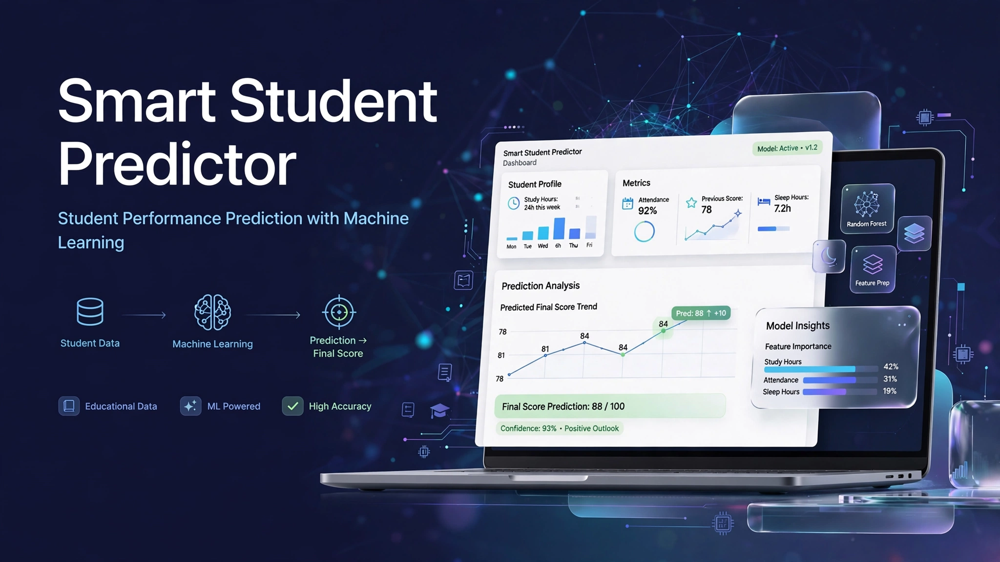

  

<h1 align="center">🎓 Smart Student Predictor</h1>

  <strong>Student performance prediction using Machine Learning.</strong>

  
  
  
  
  

  <a href="https://github.com/Yassir050/Smart-Student-Predictor">💻 Repository</a>

⸻

📖 Overview

Smart Student Predictor is an educational Machine Learning project built with Python and Scikit-learn.

The model predicts a student’s expected final score based on study-related features:

* 📚 Study Hours
* 📅 Attendance
* 📝 Previous Score
* 😴 Sleep Hours

The project demonstrates a complete beginner-friendly regression workflow, from data preprocessing to model training, evaluation, and prediction.

⚠️ Disclaimer: This project is intended for educational and demonstration purposes only. It should not be used to make real decisions about students.

⸻

🧠 Machine Learning Workflow

Student Data
     ↓
Data Cleaning
     ↓
Feature Selection
     ↓
Train / Test Split
     ↓
Linear Regression
     ↓
Model Evaluation
     ↓
Save Model
     ↓
Make Predictions

⸻

🛠️ Technologies

Technology	Purpose
Python	Programming language
Pandas	Data loading and preprocessing
NumPy	Numerical operations
Scikit-learn	Machine learning
Linear Regression	Score prediction
Joblib	Model persistence
Matplotlib	Data visualization
Git	Version control
GitHub	Source code hosting

⸻

📂 Project Structure

Smart-Student-Predictor/
│
├── assets/
│   └── smart-student-predictor-banner.png
│
├── data/
│   └── students.csv
│
├── models/
│   └── student_model.pkl
│
├── notebooks/
│   └── analysis.ipynb
│
├── src/
│   ├── preprocess.py
│   ├── train.py
│   └── predict.py
│
├── app.py
├── requirements.txt
├── README.md
└── .gitignore

Files

* students.csv — Student dataset used for training.
* preprocess.py — Loads and prepares the dataset.
* train.py — Trains and evaluates the regression model.
* predict.py — Uses the trained model to make predictions.
* analysis.ipynb — Exploratory analysis and experimentation.
* student_model.pkl — Saved trained model.
* app.py — Application entry point.
* requirements.txt — Python dependencies.
* .gitignore — Prevents unnecessary and generated files from being committed.

⸻

⚙️ Installation

1. Clone the repository

git clone https://github.com/Yassir050/Smart-Student-Predictor.git

2. Enter the project directory

cd Smart-Student-Predictor

3. Install dependencies

pip install -r requirements.txt

⸻

🚀 Training the Model

Run:

python src/train.py

The program will:

1. Load the dataset.
2. Clean the data.
3. Select the relevant features.
4. Split the data into training and testing sets.
5. Train a Linear Regression model.
6. Calculate MAE and R².
7. Save the trained model.

The trained model is saved as:

models/student_model.pkl

⸻

🔮 Making a Prediction

Run:

python src/predict.py

Example input:

Study Hours: 6
Attendance: 92
Previous Score: 75
Sleep Hours: 7

The trained model then returns an estimated final score.

⸻

📊 Model Evaluation

The project evaluates the regression model using:

MAE — Mean Absolute Error

Measures the average absolute difference between the predicted values and the actual values.

Lower MAE is better.

R² Score

Measures how well the model explains the variation in the target values.

A value closer to 1.0 generally indicates a better fit.

The exact results depend on the dataset and train/test split.

⸻

📈 Machine Learning Concepts

This project provides practical experience with:

* Regression
* Supervised Learning
* Feature selection
* Train/Test splitting
* Model training
* Model evaluation
* Prediction
* Model persistence
* Basic data analysis

⸻

🎯 Project Goal

The goal of this project is to build practical experience with Machine Learning and Python while learning how to organize a complete ML project.

This project is part of my learning path toward becoming an AI Engineer.

⸻

⚠️ Limitations

This is a learning project and has several limitations.

The dataset is relatively small and intended for demonstration purposes. Therefore, the model’s evaluation results should not be interpreted as evidence that it can accurately predict real student performance.

A production-level system would require a larger, representative dataset, stronger validation, feature analysis, and careful consideration of fairness and data privacy.

⸻

👨‍💻 Author

Yassir.B

GitHub:

https://github.com/Yassir050

Built as part of my journey toward becoming an AI Engineer.

⸻

📄 License

This project is intended for educational and portfolio purposes.
